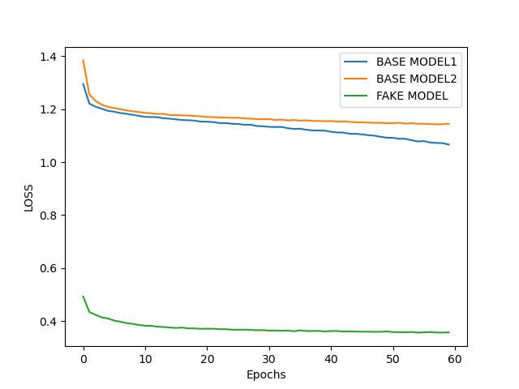
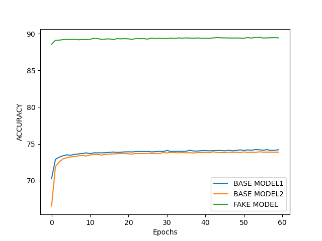
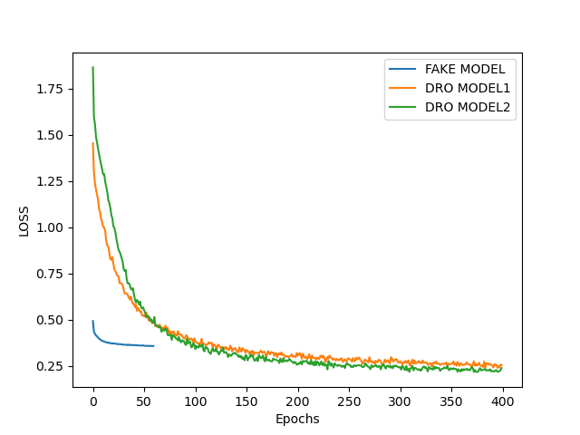
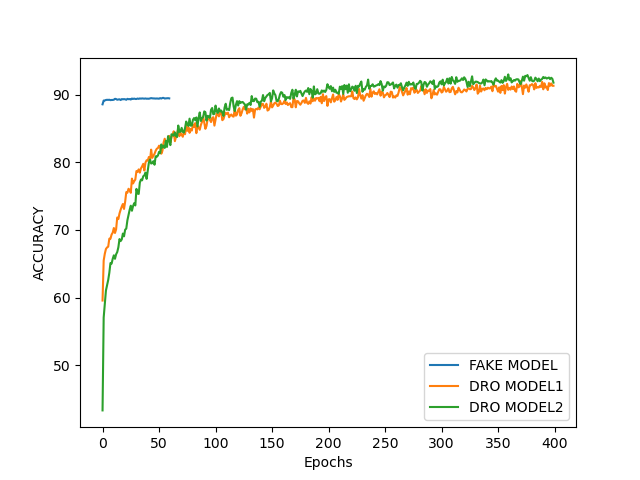
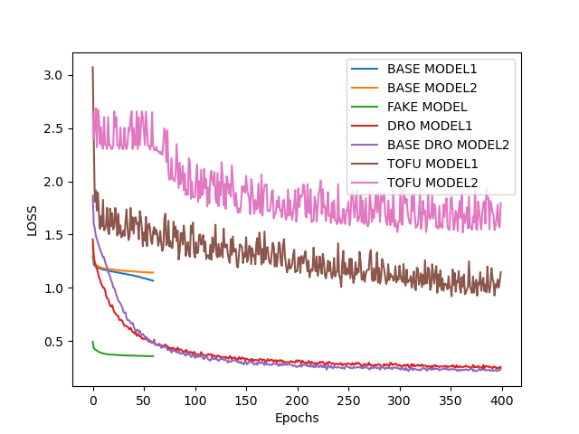
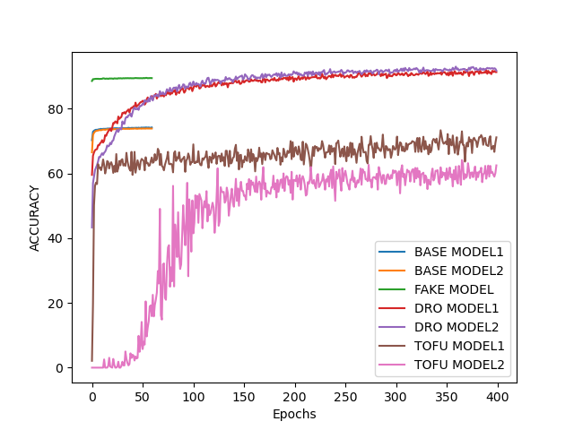

# AAI PROJECTl BY DRO
## purpose
The primary goal of this project is to train a model capable of recognizing handwritten digits in the presence of intentionally mislabeled and mutated data.

## Data
Our dataset consists of 60,000 'npy' files for training, each containing 10x28x28 arrays with labels. The validation set has 100 labeled 'npy' files, while the test set contains 9900 unlabeled 'npy' files. Derived from the MNIST database, these data have been manipulated such that they include intentional errors. Each file is structured as a 10-dimensional array where, under normal circumstances, the i-th dimension in a file labeled 'i' (for i ranging from 0-9) should contain the corresponding digit 'i'. However, there are deliberately mislabeled files where other digits replace the expected digit 'i'.

## Models

### Models Selection
Based on [3], convolutional neural networks (CNNs) exhibit strong performance in recognizing handwritten digits. Hence, we chose a CNN with padding set to 0 to minimize the impact of peripheral regions. Upon comparing [1] and [2], we adopted [1]'s strategy for this project due to its focus on learning stable features. IRM (Invariant Risk Minimization) and DRO (Distributionally Robust Optimization) are two concepts mentioned; IRM deals with datasets having varying backgrounds or unstable features, whereas DRO aims to minimize risk under worst-case scenarios. In [1], the authors attempt to learn stable features for the target task by leveraging unstable features from a source task, making their approach particularly suitable for our task.

We employ two models, CNN and MLP, as described in [1] and [3]. Their detailed structures are shown below, with the default hidden_dim being 300. Throughout this report, **the two models will be considered as one unified model.**

```
class CNN(nn.Module)
    def __init__(self, input_channel, hidden_dim):
    super(CnnM, self).__init__()
    self.conv1 = nn.Conv2d(input_channel, 32, 3, 1, padding=0)
    self.conv2 = nn.Conv2d(32, 64, 3, 1, padding=0)
    self.dropout1 = nn.Dropout(0.1)
    self.fc1 = nn.Linear(64*12*12, hidden_dim)
    ...

class MLP(nn.Module):
    def __init__(self, input_dim, output_dim):
        super(MLP, self).__init__()
        self.dropout = nn.Dropout(0.1)
        self.fc = nn.Linear(input_dim, output_dim)
    ...
```
###	Strategies Selection
Distributionally Robust Optimization (DRO) is an optimization framework designed for decision-making under uncertainty. Unlike traditional methods that rely on a single, precise probabilistic model, DRO considers a set of plausible distributions consistent with empirical data.

In essence, DRO seeks solutions that perform well across all distributions within an ambiguity set rather than optimizing solely for the best-case scenario based on point estimates. This robustness protects against potential inaccuracies in the estimated probability distribution and enhances model resilience against misspecification and changes in the data-generating process. In practical applications, DRO necessitates ensuring that the optimization considers only the most adverse loss scenario from among all possible distributions, thereby taking a backward-looking, conservative approach.

[1] introduces TOFU, a clustering method, as an effective way to handle uncertain data clusters. For training on classified data, we consider two approaches: initializing the model with weights learned from unstable features and initializing with random weights.

To address dimensional interference suppression, we initially entertained the idea of proactively excluding interference during data preprocessing. However, the TAs advised against this, leading us to train two base models based on this natural thought — one reducing dimensions to one by summing them up and another shuffling the first dimension.

For evaluation, we trained six models: two base models, one fake model learning unstable features, and four models using either simple DRO or TOFU strategies. 

|Models|Strategies|Data Preprocess|Objective|
|:---|:----|:----|:----|
|Base Model 1| Normal| Dimension Reduction| Get stable features|
|Base Model 2| Normal| First Dimension Shuffle| Get stable features|
|Fake Model 1| Normal| No | Get unstable features|
|DRO Model 1| Simpel DRO; Init with fake model| No | Get stable features|
|DRO Model 2| Simpel DRO; Init with random model| No | Get stable features|
|TOFU Model 1| TOFU; Init with fake model| No | Get stable features|
|TOFU Model 2| TOFU; Init with random model| No | Get stable features|

## Experiment 

### Base Models and Fake Model

Firstly, we trained three basic models—Base Models 1 & 2 and the Fake Model — for 60 epochs. The base models were designed to recognize digits without interference from unstable features through data preprocessing.



<br style="clear: both;">
</br>

|Models|Accuracy on Val Dataset|
|---|---|
|Base Model 1|0.77|
|Base Model 2|0.76|
|Fake Model |0.15|

From the graphs and table, it's evident that the Fake Model overfits to the training set and learns unstable features, as seen by its high training accuracy and low validation accuracy. The good performance of the base models suggests that the first dimension indeed carries unstable feature-label relations.

Simple DRO Strategy

### Simple DRO Strategy

Next, we trained models with a simple DRO strategy for 400 epochs. Under DRO, we focused on the worst loss among all classes of data and only worst loss and accuracy are recorded in each epoch. *This applies to TOFU Model 1 and 2 as well.*



<br style="clear: both;">
</br>

|Models|Accuracy on Val Dataset|
|---|---|
|DRO Model 1|0.36|
|DRO Model 2|0.35|

The results show that the simple DRO strategy only marginally improves the learning of stable features compared to the Fake Model, still predominantly learning unstable features.

### TOFU Strategy

With TOFU, we processed the data into 20 datasets based on correct and incorrect predictions by the Fake Model, enhancing representation differences between classes and similarities within classes. We then clustered these data into 20 clusters using K-means from scikit-learn, ensuring each label had two clusters. Finally, we trained the clusters using the DRO strategy.



<br style="clear: both;">
</br>

|Models|Accuracy on Val Dataset|
|---|---|
|TOFU Model 1|0.63|
|TOFU Model 2|0.75|

The graphs and tables demonstrate that the TOFU models successfully recognized digits with dimensional interference suppression. TOFU Model 2 outperformed TOFU Model 1, indicating that initializing with random weights was more effective than using a model that learned unstable features. TOFU Model 2 demonstrates a performance that is on par with that of Base Models 1 and 2, thereby showcasing similar efficacy.

## Member Contributions

All members contributed equally to the project. Specifically, Li Hao led the overall strategy and conducted experiments, Jiang Tao implemented the code, and Yuan Fei wrote the reports and contribute to the team discussions.

## References
[1] Bao, Yujia, Shiyu Chang, and Regina Barzilay. "Learning stable classifiers by transferring unstable features." International Conference on Machine Learning. PMLR, 2022.

[2] Arjovsky, Martin, et al. "Invariant risk minimization." arXiv preprint arXiv:1907.02893 (2019).

[3] LeCun, Yann, et al. "Gradient-based learning applied to document recognition." Proceedings of the IEEE 86.11 (1998): 2278-2324.

## Appendix

### Running Instructions
```
cd src
python main.py --model 1/2/3 --json_name file_name 
# There are three models: 0 is training model, 1 is run test model which will generate res.txt, 2 is evaluation model which will generate the pictures of loss and accuracy.
# json_name used as the name of file which save losses and accuracies data during training
# For simply, you can run 'python main.py' which will run model 1 defautly.
```
### Other Details
There are certain details not mentioned previously.

|Sets|Detail|
|:----|:-----|
|Optimizer|Adam with 0.001 as wight decay|
|Learning Rate| 0.001|
|Activate Function of CNN|relu|
|activate Function of MLP|log_softmax|
|Drop Out Rate|0.1|
|Python|3.10|